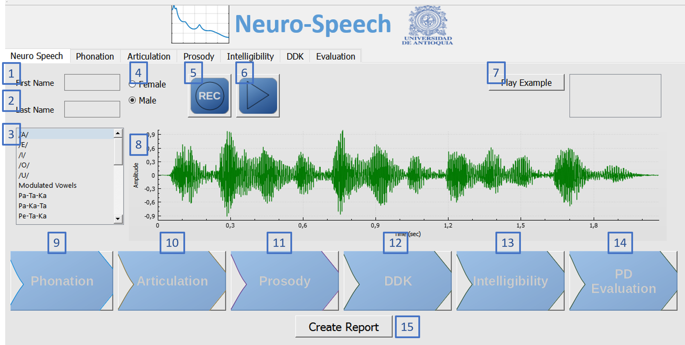

# NeuroSpeech
Neuro-Speech is an open source software platform designed to perform speech analysis of people with neuro-degenerative disorders. Particularly patients with Parkinson's disease.
The software is designed to be used by medical examiners such as speech therapists and neurologists, but it can also be used by patients to perform the analysis, and by general population interested in the analysis of pathological speech.

The software computes several measures to evaluate the communication capabilities of the patients and includes analyses of phonation, articulation, prosody, and intelligibility. The software calculates also specific bio-markers related to the dysarthria levels of the patients and perform a prediction of the Movement disorder society--Parkinson's disease rating scale, part III (MDS-UPDRS-III), which is a general evaluation of the motor capabilities of the patients.

All of the results obtained are compared to reference patterns obtained with a group of 50 healthy control speakers.

Finally a medical report can be generated, which describes the different speech deficits of the patients, and how the measures are deviated respect those computed with infromation from healthy controls

# Requeriments and Running

Neuro--Speech is a software platform designed in C++, which runs python scripts in background for the speech analysis. The software uses some third party software that can be freely downloaded and installed for the correct operation of Neuro-Speech.
The list of the third party software that must be installed previous to Neuro--Speech is as follows:

- Ananconda: Python environment. It can be installed from https://www.continuum.io/downloads
- Praat: software for speech analysis. Available at http://www.fon.hum.uva.nl/praat/
- ffmpeg: a solution to record, convert and stream audio and video. Available at http://ffmpeg.org/download.html

To execute Neuro-Speech, please go to the folder Release, and then click in the icon of PDTool.exe. Then the main is displayed

## Authors

* **Juan Camilo Vasquez-Correa** - *Initial work* - [PurpleBooth](https://github.com/jcvasquezc)

* **Juan Rafael Orozco-Aroyave**

* **Jesús Francisco Vargas Bonilla**

* **Elmar Nöth**

## License

This project is licensed under the  GNU GENERAL PUBLIC License - see the [LICENSE.md](LICENSE.md) file for details
